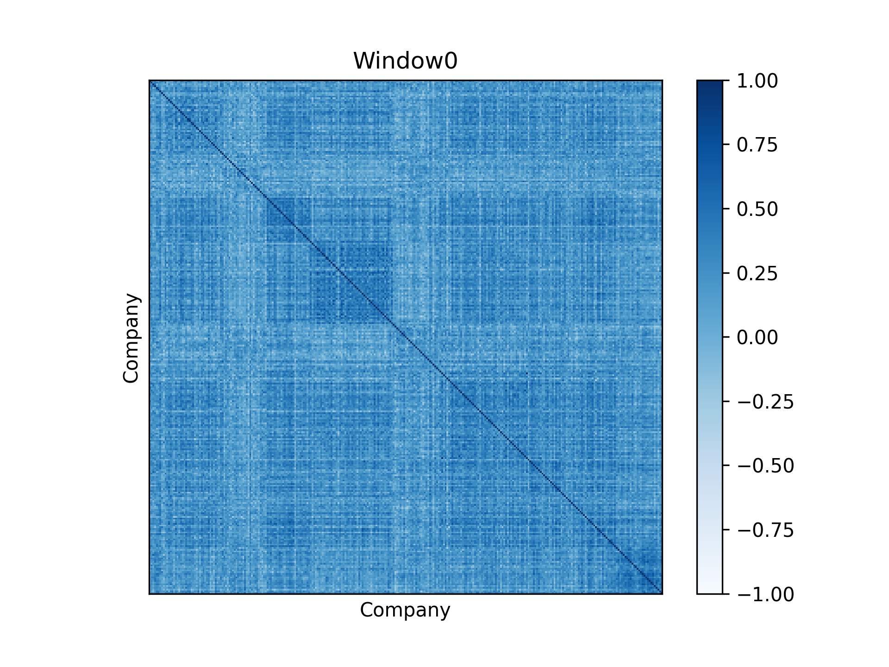

# 📈 Correlation Analysis of S&P500 Stocks

This project performs a detailed correlation analysis of stock market data for S&P500. It focuses on calculating normalized returns and generating correlation matrices across different companies over multiple time windows, visualized through informative heatmaps.

---

## 🧠 Motivation

Understanding the correlations between different stocks is a fundamental tool in financial analysis and portfolio management. This project provides a systematic approach to extract stock data, compute normalized returns using a sliding window, and visualize the relationships using heatmaps.

---

## 🚀 Features

- Extracts structured stock data from categorized CSV files
- Computes zero-mean, unit-variance normalized returns
- Calculates time-windowed correlation matrices between stocks
- Visualizes each correlation matrix as a heatmap
- Saves each heatmap as a high-resolution `.png` image

---

## 📆 Requirements

- Python 3.x
- pandas
- numpy
- scipy
- matplotlib

Install dependencies via pip:

```bash
pip install pandas numpy scipy matplotlib
```

---

## 🛠️ Usage

1. **Organize your data**  
   Place your `.csv` stock data inside folders representing categories (e.g., sectors). Each file must contain at least the following columns:
   - `Date`
   - `Open`
   - `Close`

2. **Edit the path**  
   Set the `main_folder` variable in `Correlation_Matrix.py` to the root folder of your dataset.

3. **Run the script**  
   Execute the script to perform the full pipeline:

```bash
python Correlation_Matrix.py
```

The script will:
- Extract and preprocess data
- Calculate returns and normalize them
- Compute correlation matrices in time windows
- Save heatmaps (e.g., `Window_0.png`, `Window_1.png`, etc.)

---

## 📊 Example Output



Each heatmap shows the correlation between companies in a specific time window, helping visualize how relationships between stocks evolve over time.

---

## 🤝 Contributing

Contributions are welcome! If you'd like to suggest improvements or new features, feel free to fork the repo and open a pull request.

---

## 📜 License

This project is licensed under the [MIT License](LICENSE).

